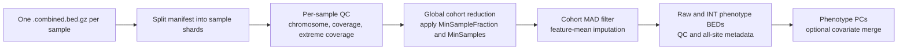

# PacBio 5mC QTL workflow

[Back to main README](../README.md)

This guide describes how to prepare pb-CpG-tools site-level 5mC calls for molecular QTL mapping. The workflow applies coverage QC per sample, filters sites against the whole cohort, applies a cohort methylation-MAD filter, mean-imputes the limited remaining missing values per feature, produces raw beta-value and inverse-normal transformed phenotype BEDs, calculates phenotype PCs, and can merge those PCs with additional QTL covariates.

## What to provide

Use one pb-CpG-tools `.combined.bed.gz` file per sample. The workflow expects the `model` pileup output and uses `mod_score` as the methylation phenotype.

| pb-CpG-tools column | Workflow use |
| --- | --- |
| `#chrom`, `begin`, `end` | Site coordinates; retained as BED coordinates. |
| `mod_score` | Methylation value. It is multiplied by `0.01` by default to produce a 0–1 beta value. |
| `type` | Must have one value per input file. Use the sample's `.combined.bed.gz` output for standard meQTL analysis. |
| `cov` | Per-site coverage used for QC and site metadata. |
| `est_mod_count`, `est_unmod_count`, `discretized_mod_score` | Retained in long-format outputs for auditability; not used as the QTL phenotype. |

All input BEDs must use the same reference genome and contig naming convention as the genotype data. The workflow removes contigs matching `X|Y|M|_` by default; set `FilterChroms` to an empty string to retain them.

## Sample manifest

Supply a TSV with a header and one row per sample:

```text
sample_id	file_path
SAMPLE_001	/mnt/methylation/SAMPLE_001.combined.bed.gz
SAMPLE_002	/mnt/methylation/SAMPLE_002.combined.bed.gz
```

`file_path` must be an absolute path that is readable inside every WDL task container. WDL localizes the manifest itself, but does not localize file paths embedded within its contents.

## Workflow design



The cohort threshold is deliberately evaluated only after every shard has completed per-sample QC. This means the required number of samples is always:

```text
max(ceiling(total_samples × MinSampleFraction), MinSamples)
```

and never depends on shard size or shard boundaries.

## QC stages and run log

For every sample, the log reports:

1. Input site count and sites removed by the chromosome filter.
2. Sites failing `MinCoverage`.
3. Sites failing the extreme-coverage filter after meeting `MinCoverage`.
4. Sites passing both per-sample thresholds.

At cohort level, the log reports the union of sites after chromosome filtering, sites observed with adequate coverage in at least one sample, sites passing all per-sample QC in at least one sample, counts passing/failing the sample-presence threshold, counts failing the methylation-MAD threshold, and the number of sample/site values imputed.

The extreme-coverage threshold is a Tukey far-out fence calculated separately for each sample on `log10(cov)`. It is intended to exclude unusually high-coverage loci that may reflect copy-number or mapping artifacts.

## Important inputs

| Input | Default | Meaning |
| --- | --- | --- |
| `SamplesPerShard` | `25` | Number of samples processed by each parallel per-sample-QC task. |
| `MinCoverage` | `10` | Minimum `cov` required for a sample/site call. |
| `MinSampleFraction` | `0.95` | Fraction of the complete cohort that must pass per-sample QC for a site to be retained. Remaining QTL-BED missing values are imputed with the feature mean. |
| `MinSamples` | `0` | Optional additional minimum number of samples passing per-sample QC. |
| `MinMethylationMAD` | `0.003` | Minimum methylation MAD across per-sample-QC-passing observations required for QTL output. |
| `FenceK` | `3.0` | Far-out-fence multiplier used for extreme coverage. |
| `ValueColumn` | `mod_score` | Column used as methylation phenotype. |
| `ValueMultiplier` | `0.01` | Converts pb-CpG `mod_score` percentages to 0–1 beta values. |
| `AdditionalCovariates` | unset | Optional TSV containing `sample_id` plus genotype PCs or other covariates to merge with INT phenotype PCs. |
| `ShardMemoryGB` / `ShardDiskGB` | `16` / `100` | Resources for each parallel shard. |
| `MergeMemoryGB` / `MergeDiskGB` | `64` / `200` | Resources for the final cohort-wide reduction. |

## Outputs

| Output | Contents |
| --- | --- |
| `<prefix>.methylation.filtered.long.tsv.gz` | Calls from sites passing the final cohort threshold. |
| `<prefix>.methylation.site_qc.tsv.gz` | Compact all-site table with sample-presence counts and `keep_site`. |
| `<prefix>.methylation.site_metadata.tsv.gz` | All observed sites, including coverage and methylation means, standard deviations, CVs, methylation MAD, coverage fractions, sample counts, filter flags, `n_samples_imputed_in_qtl_bed`, and `keep_site`. |
| `<prefix>.methylation.sample_qc.tsv` | One row per sample with coverage filter counts, extreme-coverage cutoffs, and pass counts. |
| `<prefix>.methylation.filter_summary.tsv` | Counts of sites at each mutually exclusive cohort-QC stage. |
| `<prefix>.methylation.filter_counts.png` | Bar chart of the sequential cohort-QC counts. |
| `<prefix>.methylation.filter_upset.png` | UpSet-style chart showing overlap of low/missing coverage, extreme coverage, cohort sample-presence, and methylation-MAD conditions. |
| `<prefix>.methylation.raw.bed.gz` | TensorQTL-compatible phenotype BED with raw 0–1 methylation beta values. |
| `<prefix>.methylation.INT.bed.gz` | TensorQTL-compatible phenotype BED after site-wise rank-based inverse normal transformation. |
| `<prefix>.methylation_phenotype_PCs.INT.tsv` | Phenotype PCs calculated from the INT BED. |
| `<prefix>.methylation_QTL_covariates.INT.tsv` | Optional merged covariate matrix, written when `AdditionalCovariates` is supplied. |

The site metadata has two metric families:

- `*_all_calls`: all calls remaining after chromosome filtering, including calls that fail coverage QC.
- `*_passing_per_sample_qc`: only calls passing both the minimum- and extreme-coverage filters.

`fraction_samples_min_coverage` uses the complete input cohort as its denominator. `fraction_samples_passing_per_sample_qc` additionally excludes extreme-coverage calls. `pass_sample_presence_filter` and `pass_methylation_mad_filter` show the two cohort filters separately; `keep_site` is their final combined decision.

The filter-count chart and TSV use mutually exclusive stages so the counts add up to every observed site: insufficient minimum-coverage samples, loss of sufficient samples after extreme-coverage exclusions, low MAD after sample-presence QC, or passing all cohort filters. The UpSet-style plot is complementary: it retains overlapping conditions, including a site that still passes overall QC despite one or more missing or extreme-coverage calls.

## QTL phenotype BEDs, PCs, and covariates

Both phenotype BEDs use the first four columns required by TensorQTL:

```text
#chr	start	end	phenotype_id	SAMPLE_001	SAMPLE_002	...
chr1	10469	10470	chr1*10469*10470	0.73	0.68	...
```

The raw BED contains beta values (`mod_score / 100`). For every retained feature, samples missing after per-sample QC are filled with that feature's mean beta value among observed QC-passing samples. The metadata field `n_samples_imputed_in_qtl_bed` records exactly how many cells were imputed for that feature. The INT BED then rank-transforms each imputed CpG row across samples and is used for phenotype-PC calculation. The workflow calculates PCs only for the INT BED, following the existing molecular-QTL prepare workflows.

Set `AdditionalCovariates` to a TSV with a `sample_id` column to merge genotype PCs or other covariates with the INT phenotype PCs. The resulting covariate file has covariates as rows and sample IDs as columns, ready for TensorQTL.

The WDL defaults to `MinSampleFraction = 0.95` and `MinMethylationMAD = 0.003`. This retains sites present in at least 95% of samples and produces a complete matrix through feature-mean imputation before PCA and QTL mapping.

## Related files

- [`scripts/MergeMethylationCalls.R`](../scripts/MergeMethylationCalls.R): command-line implementation, including standalone and shard-intermediate modes.
- [`workflows/merge_methylation.wdl`](../workflows/merge_methylation.wdl): WDL wrapper for parallel execution.
- [R script reference](scripts.md): reference for all project scripts.
- [Molecular QTL workflow reference](molecular-qtl-workflows.md): reference for all molecular workflow wrappers.
